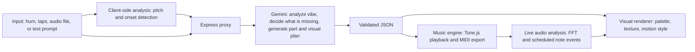

# Chromajam

**A jam partner you can see.** Give it a beat, a melody, or just a vibe. Chromajam writes the missing half, plays it back, and paints the whole song as a living visual, so music becomes readable without needing to hear it.

Built for a hackathon where the theme is using **Google Gemini as an I/O module** for a creative application.

> Screenshot / demo GIF goes here: `docs/demo.gif`

---

## Table of contents

- [What it does](#what-it-does)
- [Why it exists](#why-it-exists)
- [How it works](#how-it-works)
- [Quickstart](#quickstart)
- [Configuration](#configuration)
- [Project structure](#project-structure)
- [The Gemini contract](#the-gemini-contract)
- [Accessibility](#accessibility)
- [Known limitations](#known-limitations)
- [Roadmap](#roadmap)
- [Tech stack](#tech-stack)
- [Contributing](#contributing)
- [License](#license)

---

## What it does

Chromajam combines two ideas into one app:

1. **A MIDI and drum pattern generator.** The user provides a prompt, a hummed melody, tapped rhythm, or uploaded audio. Chromajam works out which half is missing and generates it: drums if you gave it a melody, a melody or bassline if you gave it drums, or both if you only gave it a text prompt. You get playable audio and a downloadable `.mid` file.
2. **A Sound Painter.** The music (your input and the generated part) is turned into colors, textures, and motion in real time. Each instrument keeps a consistent color and shape so the song can be followed visually as separate voices.

The two halves feed each other. The canvas is an output, and in the stretch goal it is also an input: drag on it to reshape the music.

## Why it exists

Most music tools assume you can hear the result. Most visualizers are decoration, showing volume but not meaning. Chromajam treats the visual as the primary interface for people who are deaf or hard of hearing, and also as a good way to see music for everyone else.

Gemini is the bridge in both directions. It reads messy real-world input (a hum, a phrase, a vibe) and returns structured data the app can act on.

## How it works



### Two layers, on purpose

| Layer | Runs on | Latency | Job |
|---|---|---|---|
| Semantic | Gemini | seconds | Understand the vibe, decide what to generate, choose palette, texture, and motion style |
| Real-time | Web Audio and canvas | milliseconds | Make the visuals move exactly with the sound |

Gemini decides what the song looks like. The audio engine makes it move. The app never waits on Gemini per frame.

### Pitch detection happens in the browser

Gemini is good at understanding mood, genre, and structure, but it is not a reliable pitch transcriber. So Chromajam extracts notes from a hummed melody locally (pitch detection plus onset detection) and sends Gemini both the audio and the extracted note list. Gemini writes the complementary part against notes it can trust.

### Sample pitch shifting

Sample entries in `src/music/sound-catalog.json` record one source/root note and
file extension. Sampled voices use that root file for every requested note and
apply Tone.js `PitchShift`, so a one-shot keeps
approximately the same duration instead of being sped up or slowed down.
Shifts beyond 24 semitones are rejected and logged, while invalid note names
are ignored without changing the original files. The transformation is cached
by source note and semitone interval for the lifetime of the voice.

## Quickstart

### Prerequisites

- Node.js 20 or newer
- A Gemini API key from [Google AI Studio](https://aistudio.google.com/) (the free tier is enough for development and demos, subject to its rate limits)
- A modern desktop or mobile browser with microphone access

### Install and run

```bash
git clone https://github.com/<your-username>/chromajam.git
cd chromajam
npm install
cp .env.example .env
# edit .env and add your GEMINI_API_KEY
npm run dev
```

Open the URL printed in the terminal (usually `http://localhost:5173`) and allow microphone access.

### Windows: one-click start

Double-click `start.cmd`, or run it from cmd:

```bat
start.cmd        :: dev mode with hot reload, opens http://localhost:5173
start.cmd prod   :: production build served on http://localhost:3001
```

It checks for Node 20+, installs packages on first run, creates `.env` from `.env.example` if missing, and opens the browser when the app is ready. If Chromajam is already running it just opens the browser. Press Ctrl+C in the window to stop.

### Scripts

| Command | What it does |
|---|---|
| `npm run dev` | Starts the Vite client and the Express proxy together |
| `npm run build` | Builds the client for production |
| `npm start` | Serves the built client and the proxy from one Node process |
| `npm run lint` | Runs the linter |

### Try it without an API key

If no key is set, or a request fails, Chromajam falls back to cached presets in `src/fallback/presets.json`. This keeps demos alive on bad Wi-Fi and lets you work on the UI offline.

## Configuration

Environment variables (see `.env.example`):

| Variable | Required | Default | Notes |
|---|---|---|---|
| `GEMINI_API_KEY` | Yes (unless using fallback) | none | Kept on the server. Never exposed to the browser. |
| `GEMINI_MODEL` | No | `gemini-3.6-flash` | Any Gemini model that supports audio input and JSON output. Check AI Studio for current model names. |
| `GEMINI_FALLBACK_MODELS` | No | `gemini-flash-lite-latest,gemini-3.5-flash,gemini-3.7-flash` | Tried in order when the primary model is overloaded (503), out of quota (429) or too slow. Each model has its own free-tier daily quota. |
| `PORT` | No | `3001` | Express proxy port |
| `MAX_AUDIO_SECONDS` | No | `15` | Longest recording sent to Gemini |
| `USE_FALLBACK_ONLY` | No | `false` | Forces cached presets, useful for rehearsing a demo |

## Project structure

```
chromajam/
├─ README.md
├─ .env.example
├─ package.json
├─ vite.config.js
├─ index.html
├─ server/
│  ├─ index.js          # Express app, /api/generate and /api/refine
│  ├─ gemini.js         # Gemini client and request builder
│  ├─ prompt.js         # System prompt and few-shot examples
│  └─ schema.js         # JSON response schema and validation
├─ src/
│  ├─ main.js           # App bootstrap and state
│  ├─ input/
│  │  ├─ record.js      # Microphone recording
│  │  ├─ wav.js         # Encode recordings to 16 kHz mono WAV
│  │  ├─ pitch.js       # Pitch and onset detection for hummed melodies
│  │  └─ taps.js        # Tap tempo and rhythm capture
│  ├─ api/client.js     # Calls the Express proxy, handles fallback
│  ├─ music/
│  │  ├─ engine.js      # Tone.js transport, instruments, scheduling
│  │  ├─ humanize.js    # Swing, velocity, and timing variation
│  │  └─ midi.js        # .mid export
│  ├─ visuals/
│  │  ├─ renderer.js    # Canvas loop, reads analyser and note events
│  │  ├─ styles/        # watercolor, ink, neon, grain, glass
│  │  ├─ palettes.js
│  │  └─ safety.js      # Flash-rate limiter and calm mode
│  ├─ a11y/
│  │  ├─ haptics.js     # Vibration patterns per instrument
│  │  └─ settings.js    # User-customizable mappings
│  ├─ ui/
│  │  ├─ controls.js
│  │  └─ debugPanel.js  # Shows what Gemini saw and returned
│  └─ fallback/presets.json
└─ docs/
```

## The Gemini contract

One request in, one validated JSON object out. The server asks Gemini for JSON using a response schema, then validates and repairs the result before it reaches the client (clamping values, filling missing lanes, rejecting malformed notes).

```json
{
  "analysis": {
    "tempo": 92,
    "key": "D minor",
    "time_signature": "4/4",
    "mood": ["melancholic", "hopeful"],
    "genre_hint": "lo-fi hip hop",
    "energy_curve": [0.2, 0.4, 0.7, 0.5],
    "provided": "melody",
    "generated": "drums"
  },
  "groove": { "swing": 0.15, "humanize": 0.3 },
  "drums": {
    "bars": 2,
    "kick":  [1,0,0,0, 0,0,1,0, 1,0,0,0, 0,1,0,0, 1,0,0,0, 0,0,1,0, 1,0,0,0, 0,1,0,1],
    "snare": [0,0,0,0, 1,0,0,0, 0,0,0,0, 1,0,0,0, 0,0,0,0, 1,0,0,0, 0,0,0,0, 1,0,0,1],
    "hat":   [1,1,1,1, 1,1,1,1, 1,1,1,1, 1,1,1,1, 1,1,1,1, 1,1,1,1, 1,1,1,1, 1,1,1,1],
    "clap":  [],
    "perc":  []
  },
  "melody": [
    { "pitch": "D4", "start": 0, "dur": 0.5, "vel": 0.8 }
  ],
  "bass": [],
  "visual": {
    "palette": ["#1b2a49", "#e07a5f", "#f2cc8f", "#81b29a"],
    "texture": "watercolor",
    "motion": "swell",
    "instrument_colors": { "kick": "#e07a5f", "snare": "#f2cc8f", "hat": "#81b29a", "melody": "#3d5a80" },
    "instrument_shapes": { "kick": "circle", "snare": "square", "hat": "triangle", "melody": "line" },
    "calm_mode_recommended": false
  },
  "director_note": "Short human-readable description of what was generated and why."
}
```

Conventions:

- Drum lanes are arrays of 16 steps per bar. Length is `16 * bars`. Values are `0` or `1`.
- Melody and bass `start` and `dur` are measured in beats from the start of the loop.
- Drums map to General MIDI on channel 10: kick 36, snare 38, closed hat 42, clap 39, percussion 45.
- `texture` is one of `watercolor`, `ink`, `neon`, `grain`, `glass`.
- `motion` is one of `drift`, `pulse`, `swell`, `scatter`, `ripple`.
- Swing and humanization are applied on the client, not generated note by note, so playback stays deterministic.

## Accessibility

Accessibility is the core feature, not an add-on.

- **Instrument identity is never color alone.** Every instrument has a color, a shape, and a screen region, so the visual works for color-blind users too.
- **Haptics.** On supported devices, kick and snare hits trigger vibration patterns via the Vibration API. This works on most Android browsers and not on iOS Safari.
- **Photosensitivity safety.** A limiter caps flashes to no more than 3 per second (following WCAG 2.3.1), and a **calm mode** removes strobing and reduces motion.
- **Customizable mappings.** Users can change which colors, shapes, and motions represent which instruments.
- **Reduced motion.** The app respects the `prefers-reduced-motion` setting.
- **Keyboard operable.** Every control is reachable and usable without a mouse.

Chromajam was designed from assumptions about what deaf and hard-of-hearing musicians might want, and those assumptions need to be tested with actual users. If you are a deaf or hard-of-hearing musician, we would love your feedback, and we will credit contributors who want credit.

## Known limitations

- **Generated music is pattern-level, not studio-grade.** Output is short loops of drums, melody, and bass rendered by browser synths.
- **Hummed pitch detection is imperfect.** Noisy rooms and unsteady humming produce wrong notes. Recording in a quiet space helps.
- **Free-tier rate limits.** Heavy use may hit Gemini API limits. The fallback presets cover this for demos.
- **Haptics depend on the device.** iOS Safari does not support the Vibration API.
- **Visual mappings are our interpretation.** They are a starting point, not a standard.

## Roadmap

**Core (hackathon scope)**
- [x] Record or type input, generate the missing half
- [x] Play back with Tone.js and export `.mid`
- [x] Real-time visuals driven by FFT and note events
- [x] Debug panel showing Gemini's input and JSON output

**Stretch**
- [ ] **Paint-back:** drag on the canvas to reshape the music; Gemini reinterprets the edit
- [ ] Session recording: export the canvas and audio together as a shareable video
- [ ] Refinement buttons ("same vibe, more energy", "another take")
- [ ] Multi-track stacking with a visual voice per layer
- [ ] Two-player mode, one on melody and one on drums
- [ ] Live mode using the Gemini Live API
- [ ] Real drum samples instead of synthesized drums
- [ ] Multi-track DAW export for Ableton, GarageBand, and FL Studio
- [ ] Live captions with emotional typography for vocals

## Tech stack

- **Gemini API** (`@google/genai`) for audio understanding, generation, and structured JSON output
- **Node.js and Express** as a thin proxy that keeps the API key off the client
- **Vite** with vanilla JavaScript for the client
- **Tone.js** for synthesis, drum playback, and transport scheduling
- **@tonejs/midi** for MIDI export
- **Web Audio API** (`AnalyserNode`) for live FFT
- **Canvas 2D** for visuals
- **Pitchy** (or an equivalent autocorrelation implementation) for pitch detection

## Contributing

Issues and pull requests are welcome. Please:

1. Open an issue describing the change before starting large work.
2. Keep the Gemini contract in `server/schema.js` and this README in sync.
3. Test visuals with calm mode on and off.
4. Never commit API keys. `.env` is gitignored.

## License

MIT. See `LICENSE`.

## Sound credits

Chromajam ships a curated subset of free samples in `public/samples/` so it works offline:

- **Instruments** (guitars, bass, strings, winds, brass, mallets, harp, organ): [tonejs-instruments](https://github.com/nbrosowsky/tonejs-instruments) by Nicholas Brosowsky, samples licensed [CC-BY 3.0](https://creativecommons.org/licenses/by/3.0/).
- **Grand piano**: Salamander Grand Piano by Alexander Holm, via the [Tone.js audio repo](https://github.com/Tonejs/audio), licensed CC-BY 3.0.
- **Drum kits**: the [Tone.js audio repo](https://github.com/Tonejs/audio) drum samples, originally from Chris Wilson's [web-audio-samples](https://github.com/cwilso/web-audio-samples).

Synth voices (supersaw, pluck, FM bell, 808, reese, acid and others), the handclap and the 808 kick are synthesized in `src/music/instruments.js`.

## Credits

Built at [Hackathon Name] by [Team Names]. Thanks to everyone who gave feedback on accessibility and design.
